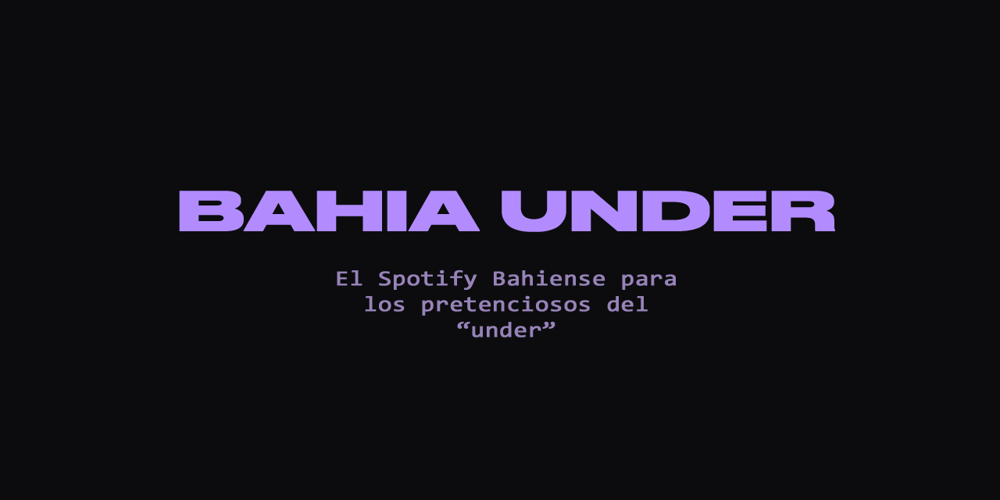

# Bahia Under




> Plataforma web para la escena musical independiente de Bahía Blanca, Argentina.

---

## Índice

- [Descripción](#descripción)
- [Capturas de Pantalla](#capturas-de-pantalla)
- [Características](#características)
- [Stack Tecnológico](#stack-tecnológico)
- [Versionado](#versionado)
- [Licencia](#licencia)
- [Contacto](#contacto)

---

## Descripción

**Bahia Under** es una plataforma digital que da visibilidad a los artistas locales de Bahía Blanca. Los artistas pueden subir y promocionar su música de forma gratuita, y los oyentes pueden descubrir, reproducir y descargar contenido musical de la escena local.

### Características principales

- Gratuito y sin comisiones
- Enfocado en la escena local
- Código abierto y transparente
- Los artistas mantienen todos sus derechos

---

## Capturas de Pantalla

> Las capturas se encuentran en `docs/screenshots/`

### Página Principal

*Vista principal con últimos lanzamientos y música destacada*

### Reproductor de Música

*Reproductor web integrado con controles completos*

### Subida de Lanzamientos

*Interfaz para artistas: subida de álbumes, EPs y singles*

### Perfil de Artista

*Perfil personalizable con biografía, redes y discografía*

### Agenda de Eventos

*Calendario de eventos musicales con mapas integrados*

### Blog

*Contenido editorial sobre la escena local*

---

## Características

### Para Artistas
- Subida gratuita de álbumes, EPs y singles
- Reproductor web integrado con streaming de alta calidad
- Gestión de portadas y metadatos (título, género, año, etc.)
- Perfil personalizable con biografía y redes sociales
- Opción de descarga gratuita para oyentes

### Para Oyentes
- Descubrimiento de música local
- Reproductor web completo
- Descarga gratuita de lanzamientos
- Seguimiento de artistas favoritos
- Comentarios y discusión en publicaciones

### Para la Comunidad
- Agenda de eventos musicales
- Blog con contenido editorial
- Sistema de moderación para contenido
- Temas personalizables (claro/oscuro)
- Responsive design (móvil, tablet, desktop)

---

## Stack Tecnológico

- **Backend**: PHP 8.0+ (vanilla, sin frameworks)
- **Base de Datos**: MySQL 8.0+
- **Frontend**: HTML5, CSS3, JavaScript (vanilla)
- **Librerías**:
  - [getID3](https://github.com/JamesHeinrich/getID3) - Extracción de metadatos de audio
  - Composer para gestión de dependencias
- **Servidor**: Apache 2.4+ (XAMPP)

---

## Versionado

Este proyecto usa [Semantic Versioning](https://semver.org/):

- **0.x.x** = Pre-release / Beta (desarrollo activo)
- **1.0.0** = Primera versión estable pública
- **1.x.x** = Nuevas features (sin romper compatibilidad)
- **2.0.0** = Cambios que rompen compatibilidad

**Versión actual:** `0.9.0-beta`

Consulta el archivo [VERSION](VERSION) para detalles de cada release.

---

## Licencia

Este proyecto está bajo la Licencia MIT. Ver el archivo [LICENSE](LICENSE) para más detalles.

```
MIT License - Copyright (c) 2025 Gabriel Romero
```

Permisos:
- Uso comercial
- Modificación del código
- Distribución
- Uso privado

Con la condición de incluir el aviso de copyright y licencia.

---

## Contacto

**Alex Ofner** aka **hatemecha**  
*Desarrollador y mantenedor*

- Email: [alex_dlarg@proton.me](mailto:alex_dlarg@proton.me)
- Instagram: [@hatemecha](https://instagram.com/hatemecha)
- GitHub: [@hatemecha](https://github.com/hatemecha)

### Preguntas o sugerencias

- Abre un [Issue](https://github.com/hatemecha/bahia-under-web/issues) en GitHub
- Contacta por email o Instagram
- Contribuye al código con un Pull Request

---
