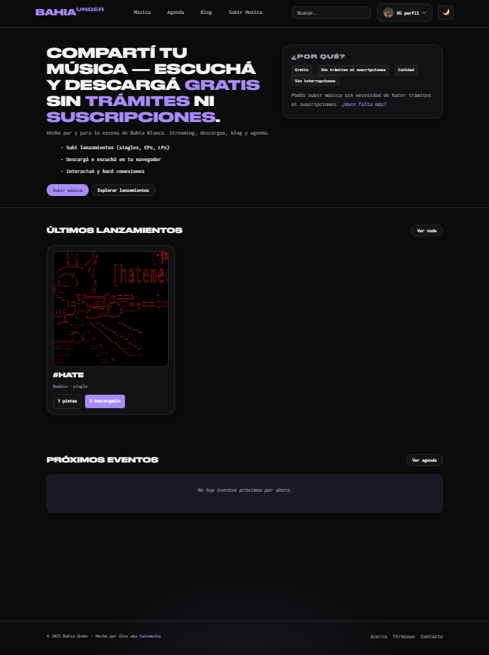
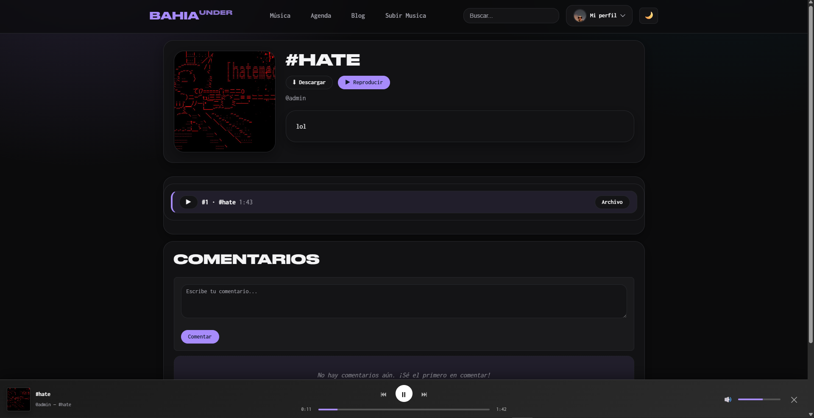
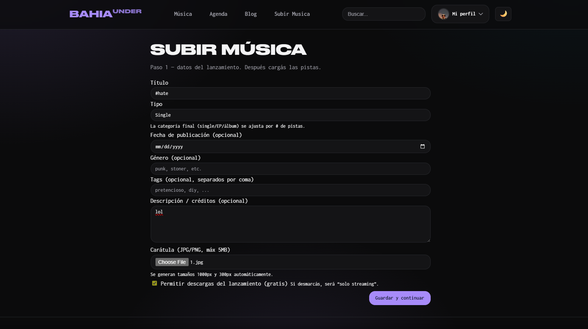
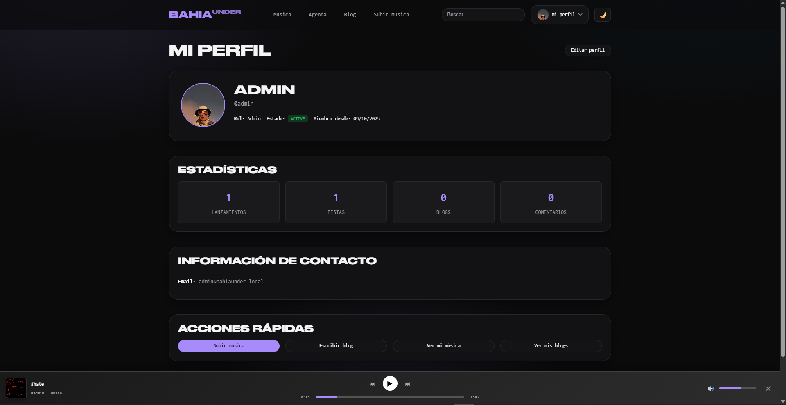
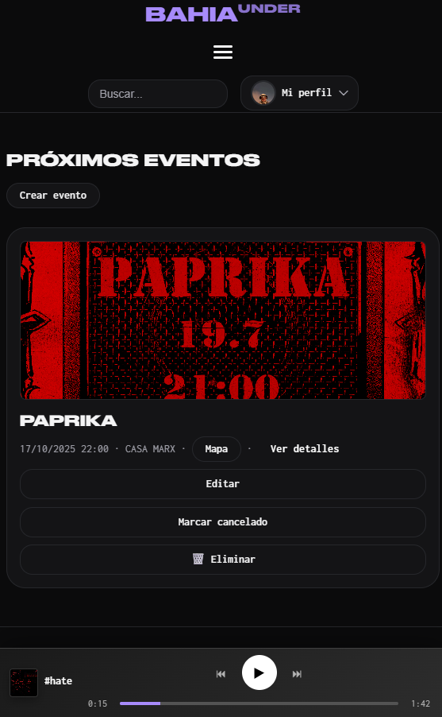
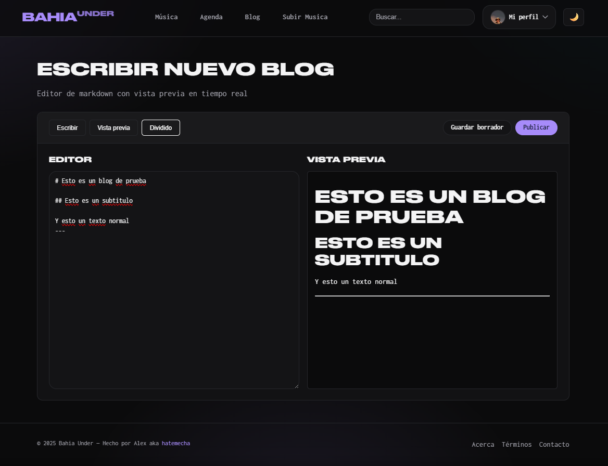

# Bahia Under


> Plataforma web para la escena musical independiente de Bahía Blanca, Argentina.

---

## 📋 Índice

- [Descripción](#-descripción)
- [Capturas de Pantalla](#-capturas-de-pantalla)
- [Características](#-características)
- [Stack Tecnológico](#️-stack-tecnológico)
- [Instalación](#-instalación)
- [Configuración](#️-configuración)
- [Roadmap](#-roadmap)
- [Contribución](#-contribución)
- [Versionado](#-versionado)
- [Licencia](#-licencia)
- [Contacto](#-contacto)

---

## 🎯 Descripción

**Bahia Under** es una plataforma digital diseñada para dar visibilidad y apoyo a los artistas locales de Bahía Blanca. Permite subir y promocionar su música de forma gratuita, mientras que los oyentes pueden descubrir, reproducir y descargar contenido musical de la escena local.

### ¿Por qué Bahia Under?

- **Gratuito y sin comisiones**: Sin costos ocultos ni porcentajes sobre las descargas
- **Enfocado en lo local**: Creado específicamente para la escena bahiense
- **Open Source**: Código abierto y transparente
- **Control total**: Los artistas mantienen todos sus derechos

---

## 📸 Capturas de Pantalla

> Las capturas se encuentran en `docs/screenshots/`

### Página Principal

*Vista principal con últimos lanzamientos y música destacada*

### Reproductor de Música

*Reproductor web integrado con controles completos*

### Subida de Lanzamientos

*Interfaz para artistas: subida de álbumes, EPs y singles*

### Perfil de Artista

*Perfil personalizable con biografía, redes y discografía*

### Agenda de Eventos

*Calendario de eventos musicales con mapas integrados*

### Blog

*Contenido editorial sobre la escena local*

---

## ✨ Características

### Para Artistas
- ✅ Subida gratuita de álbumes, EPs y singles
- ✅ Reproductor web integrado con streaming de alta calidad
- ✅ Gestión de portadas y metadatos (título, género, año, etc.)
- ✅ Perfil personalizable con biografía y redes sociales
- ✅ Opción de descarga gratuita para oyentes

### Para Oyentes
- ✅ Descubrimiento de música local
- ✅ Reproductor web completo
- ✅ Descarga gratuita de lanzamientos
- ✅ Seguimiento de artistas favoritos
- ✅ Comentarios y discusión en publicaciones

### Para la Comunidad
- ✅ Agenda de eventos musicales
- ✅ Blog con contenido editorial
- ✅ Sistema de moderación para contenido
- ✅ Temas personalizables (claro/oscuro)
- ✅ Responsive design (móvil, tablet, desktop)

---

## 🛠️ Stack Tecnológico

- **Backend**: PHP 8.0+ (vanilla, sin frameworks)
- **Base de Datos**: MySQL 8.0+
- **Frontend**: HTML5, CSS3, JavaScript (vanilla)
- **Librerías**:
  - [getID3](https://github.com/JamesHeinrich/getID3) - Extracción de metadatos de audio
  - Composer para gestión de dependencias
- **Servidor**: Apache 2.4+ (XAMPP recomendado para desarrollo)

### Filosofía de Desarrollo

Este proyecto prioriza:
- ✅ **Simplicidad**: Código legible sin abstracciones innecesarias
- ✅ **Performance**: Optimizado para hosting compartido básico
- ✅ **Accesibilidad**: Funciona sin JavaScript moderno (Progressive Enhancement)
- ✅ **Seguridad**: Headers de seguridad, prepared statements, sanitización

---

## 📦 Instalación

<details>
<summary><b>Requisitos previos</b></summary>

- PHP 8.0 o superior
- MySQL 8.0 o superior
- Composer
- Servidor web (Apache recomendado)
- Extensiones PHP:
  - `pdo_mysql`
  - `mbstring`
  - `fileinfo`
  - `openssl`

Para desarrollo local, recomendamos [XAMPP](https://www.apachefriends.org/).

</details>

<details>
<summary><b>Pasos de instalación</b></summary>

### 1. Clonar el repositorio

```bash
git clone https://github.com/hatemecha/bahia-under-web.git
cd bahia-under-web
```

### 2. Instalar dependencias

```bash
composer install
```

### 3. Configurar variables de entorno

Copiar el archivo de ejemplo y configurar:

```bash
cp env.example .env
```

Editar `.env` con tus credenciales:

```env
# Base de datos
DB_HOST=localhost
DB_NAME=bahia_under
DB_USER=root
DB_PASS=tu_contraseña

# Seguridad (generar claves únicas)
APP_KEY=tu_clave_app_generada
ENCRYPTION_KEY=tu_clave_encriptacion_generada

# Entorno
APP_ENV=development
APP_DEBUG=true
```

**Generar claves de seguridad:**

```bash
php -r "echo 'APP_KEY=' . bin2hex(random_bytes(32)) . PHP_EOL;"
php -r "echo 'ENCRYPTION_KEY=' . bin2hex(random_bytes(32)) . PHP_EOL;"
```

### 4. Crear base de datos

Importar el schema SQL:

```bash
mysql -u root -p < database/schema.sql
```

O manualmente en phpMyAdmin:
1. Crear base de datos: `bahia_under`
2. Importar archivo: `database/schema.sql`

### 5. Configurar permisos

Dar permisos de escritura a las carpetas de media:

```bash
# Linux/Mac
chmod -R 775 media/
chmod -R 775 logs/

# Windows (XAMPP)
# Los permisos suelen estar bien por defecto
```

### 6. Configurar servidor web

**Apache (XAMPP):**

Copiar proyecto en `htdocs/`:
```
C:\xampp\htdocs\bahia-under-web\
```

Acceder en: `http://localhost/bahia-under-web/`

**Virtual Host (opcional):**

Agregar en `httpd-vhosts.conf`:

```apache
<VirtualHost *:80>
    ServerName bahiaunder.local
    DocumentRoot "C:/xampp/htdocs/bahia-under-web"
    <Directory "C:/xampp/htdocs/bahia-under-web">
        AllowOverride All
        Require all granted
    </Directory>
</VirtualHost>
```

### 7. Crear usuario administrador

Visitar: `http://localhost/bahia-under-web/register.php`

Registrar tu usuario y luego ejecutar en MySQL:

```sql
UPDATE users SET role = 'admin' WHERE id = 1;
```

### 8. ¡Listo!

El sitio ya debería estar funcionando. Inicia sesión y comienza a subir música.

</details>

---

## ⚙️ Configuración

### Variables de Entorno Importantes

| Variable | Descripción | Default | Producción |
|----------|-------------|---------|------------|
| `APP_ENV` | Entorno (development/production) | `development` | `production` |
| `APP_DEBUG` | Mostrar errores detallados | `true` | `false` |
| `DB_HOST` | Host de MySQL | `localhost` | - |
| `DB_NAME` | Nombre de la base de datos | `bahia_under` | - |
| `DB_USER` | Usuario de MySQL | `root` | - |
| `DB_PASS` | Contraseña de MySQL | `` | ⚠️ Requerido |
| `APP_KEY` | Clave de aplicación | - | ⚠️ Requerido |
| `ENCRYPTION_KEY` | Clave de encriptación | - | ⚠️ Requerido |
| `FORCE_HTTPS` | Forzar HTTPS | `false` | `true` |
| `SESSION_SECURE` | Cookies solo por HTTPS | `false` | `true` |

Ver `env.example` para todas las opciones disponibles.


## 🤝 Contribución

¡Las contribuciones son bienvenidas! Este proyecto está abierto a cualquiera que quiera mejorar la escena musical local.

### Cómo contribuir

1. Fork el proyecto
2. Crea una rama para tu feature (`git checkout -b feature/nueva-funcionalidad`)
3. Commit tus cambios (`git commit -m 'Agrega nueva funcionalidad'`)
4. Push a la rama (`git push origin feature/nueva-funcionalidad`)
5. Abre un Pull Request


## 📌 Versionado

Este proyecto usa [Semantic Versioning](https://semver.org/):

- **0.x.x** = Pre-release / Beta (desarrollo activo)
- **1.0.0** = Primera versión estable pública
- **1.x.x** = Nuevas features (sin romper compatibilidad)
- **2.0.0** = Cambios que rompen compatibilidad

**Versión actual:** `0.9.0-beta`

Consulta el archivo [VERSION](VERSION) para detalles de cada release.

---

## 📄 Licencia

Este proyecto está bajo la Licencia MIT. Ver el archivo [LICENSE](LICENSE) para más detalles.

```
MIT License - Copyright (c) 2025 Gabriel Romero
```

Esto significa que puedes:
- ✅ Usar comercialmente
- ✅ Modificar el código
- ✅ Distribuir
- ✅ Uso privado

Con la condición de incluir el aviso de copyright y licencia.

---

## 📞 Contacto

**Alex Ofner** aka **hatemecha**  
*Desarrollador y mantenedor*

- 📧 Email: [alex_dlarg@proton.me](mailto:alex_dlarg@proton.me)
- 📷 Instagram: [@hatemecha](https://instagram.com/hatemecha)
- 💻 GitHub: [@hatemecha](https://github.com/hatemecha)

### ¿Preguntas? ¿Sugerencias?

- Abrí un [Issue](https://github.com/hatemecha/bahia-under-web/issues) en GitHub
- Escribime por email o Instagram
- Contribuí al código con un Pull Request

---

## 🙏 Agradecimientos

- Gracias por ver

---


</div>

